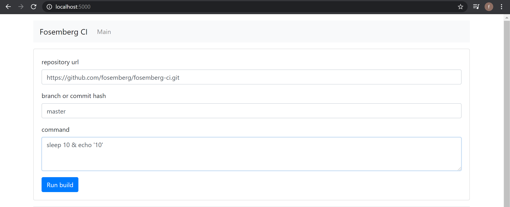

# fosemberg-ci
Простая система continuous integration.

[](https://yadi.sk/i/9SPnjGzA13iNAA)

[ТЗ](docs/TASK.md)

## Технологии

- **typescript** отличается от JavaScript возможностью явного статического назначения типов, что призвано повысить скорость разработки, облегчить читаемость, рефакторинг и повторное использование кода, помочь осуществлять поиск ошибок на этапе разработки и компиляции. Особенно был полезен для написания интерфейсов, использующихся одновременно в трех разных местах: сервер, агент, фронт.
- **express** - быстрый, гибкий, минималистичный веб-фреймворк для приложений Node.js. Использовался для реализации API, общения между серверами, взаимодействия с базой.
- **websocket** - протокол связи поверх TCP-соединения, предназначенный для обмена сообщениями между браузером и веб-сервером в режиме реального времени. Использовался для отображения статуса билдов в реальном времени.
- **nedb** - встраиваемая база данных для NodeJS, реализующая подмножество MongoDB API. Эта легкая NoSQL СУБД написана на чистом JavaScript, не имеет бинарных зависимостей. Использовалась для хранения исторической и текущей информации о сборках.
- **react** используется для разработки одностраничных приложений. Его цель — предоставить высокую скорость, простоту, масштабируемость и защиту от XSS атак. Испольозвася для написания интерфейса приложения.
- **creat react app** - отличный инструмент для быстрого старта React-приложений. Благодаря creat react app сэкономил много врмени на настройку окружения для React.
- **react bootstrap** - дизайн система. Сэкономила много времени на создание отзывчивого и красивого интейрфейса.

## Зависимости

- [nodejs](https://nodejs.org/en/)
- [git](https://git-scm.com/downloads)
- [npm](https://www.npmjs.com/get-npm) (обычно устанавливается вместе с nodejs)
- [yarn](https://www.npmjs.com/package/yarn) (опционально, вместо yarn можно использовать во всех командах ниже npm)

## Запуск

## Production запуск

#### Скопировать дефолтные конфиги

```bash
yarn &&
yarn run copy-default-configs
```

#### Запуск server

```bash
cd server &&
yarn &&
yarn run start
```

Открыть в хроме:

http://localhost:5000 

#### Запуск agent

```bash
cd agent &&
yarn &&
yarn run start
```

#### Проверка функционала

Для проверки корректности работы Fosemberg CI можно вбить в форму:

repository url: ```https://github.com/fosemberg/fosemberg-ci.git```

branch or commit hash: ```master```

command: ```sleep 10 & echo '10'```

отправить на сборку, нажав на кнопку: "Run build"



Повторить эту процеудуру несколько раз и тогда можно увидеть, что задачи отправляются на сервер и идет процесс сборки.

Чтобы ускроить сборку, можно поднять второго агента:

```bash
cd agent &&
yarn run start-2
```

После этого процесс сборки будет выполняться параллельно на 2 разных агентах, что приведет к увеличению скорости сборки в 2 раза, при наличие задач в очереди.

Также в Fosemberg CI можно посмотреть подробности сборки, нажав на любую строку сборки. Чтобы вернуться обратно к главной странице приложения нажмите на шапку с названием: "Fosemberg CI" и вы вернетесь на главную страницу.

## Dev запуск

#### Запуск server back

```npm
cd server/back &&
yarn &&
yarn run dev
```

#### Запуск server front

```npm
cd server/front &&
yarn &&
yarn run dev
```

#### Запуск agent

```npm
cd agent &&
yarn &&
yarn run dev
```

## Схемы работы приложения

### Общая схема сборки

```
title easy build process

client->server:build
server->agent:build
agent->server:notify_build_result
server->client:notify_build_result
```


### Подробная схема сборки

```
title build process detailed

client->client:init
server->server:restore data from db
client->server:get_all_builds
server->client:all_builds
client->server:build
server->server:great empty build in db
server->agent:build
agent->server:notify_build_result
server->agent:i am alive
server->client:notify_build_result
server->server:save to db
```


[service for UML visualization](https://sequencediagram.org/)