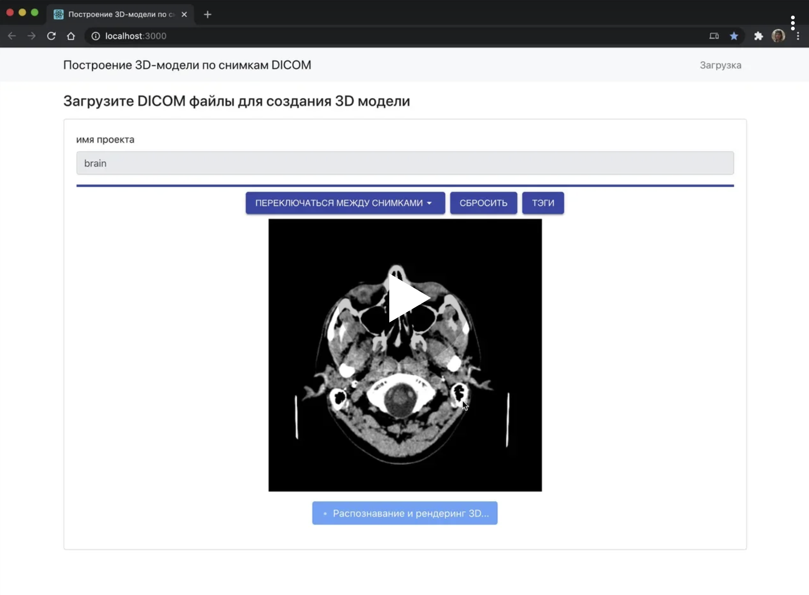
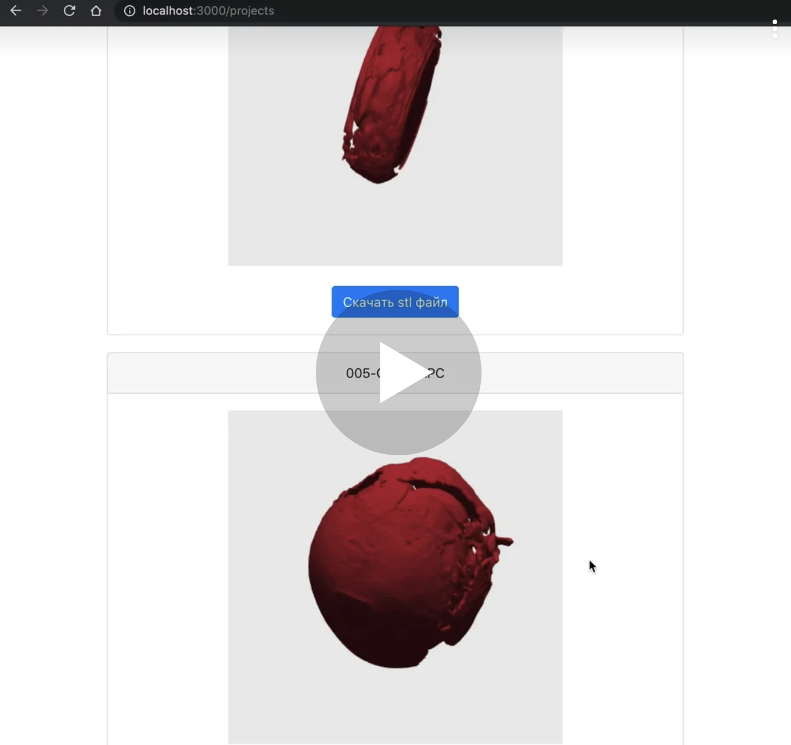

# Dicom to 3d
A system for converting dicom files into 3D images.

## Demo video

Download and recognition:
[](https://yadi.sk/i/uLEea5gBJmR08w)

Viewing a list of 3d models:
[](https://yadi.sk/i/GCG3vuqKTqNOnA)

## Technologies

dicom to 3d converter:
- **python**
- **SimpleITK**
- **vtk**
- **numpu**

Part of the frontend:  
- **typescript** differs from JavaScript in the possibility of explicit static assignment of types, which is designed to increase the speed of development, facilitate readability, refactoring and reuse of code, and help to search for errors at the development and compilation stage. It was especially useful for writing interfaces that are used simultaneously in two different places: the server and the agent.
- **express** - fast, flexible, minimalistic web framework for applications Node.js . It was used to implement the API, communicate between servers, and interact with the database.
- **websocket** - a communication protocol over a TCP connection designed to exchange messages between a browser and a web server in real time. It was used to display the status of builds in real time.
- **react** is used to develop single-page applications. Its goal is to provide high speed, simplicity, scalability and protection against XSS attacks. It was used to write the application interface.
- **creat react app** - a great tool for quick start of React applications. Thanks to creat react app, the app has saved a lot of time on setting up the environment for React.
- **react bootstrap** - the design of the system. It saved me a lot of time to create a responsive and beautiful interface.
- **bem** - [about the methodology](https://en.bem.info/methodology/quick-start/)
- **multer** - express js library for saving files to the file system that came from the user.
- **dwv** - DWV (DICOM Web Viewer) is an open source zero footprint medical image viewer library. It uses _only_ javascript and HTML5 technologies, meaning that it can be run on any platform that provides a modern browser (laptop, tablet, phone and even modern TVs). It can load local or remote data in DICOM format (the standard for medical imaging data such as MR, CT, Echo, Mammo, NM...) and  provides standard tools for its manipulation such as contrast, zoom, drag, possibility to draw regions on top of the image and imaging filters such as threshold and sharpening.

## System dependencies

- [python](https://www.python.org/)
- [nodejs](https://nodejs.org/en/)
- [npm](https://www.npmjs.com/get-npm) (it is usually installed together with nodejs)
- [yarn](https://www.npmjs.com/package/yarn) (optionally, instead of yarn, it can be used in all commands below npm)

## Installing the project

- [windows](docs/windows-install.md)
- [ubuntu](docs/ubuntu-install.md)

## Dev run

#### Run server back

```npm
cd server/back &&
yarn &&
yarn run dev
```

#### Run server front

```npm
cd server/front &&
yarn &&
yarn run start
```

## The scheme of the application

```
title images to 3d
react->node js: images
node js->file system: images
react->node js: make 3d
node js->python cli: make 3d
file system->python cli:images
python cli->python cli:make 3d
file system<-python cli:3d
node js<-file system:3d
react<-node js:3d
react->react:visualate 3d
```

[](https://sequencediagram.org/index.html#initialData=C4S2BsFMAIQWwIYHNIGdrAPbQMwBMAoAJ0gQGNgBaAPgDtM8YArVALlkRVQPsehZoAzEFGioAnqmCQ47eMjTFSFGr2ZtoiANYx8PBupoAHccAAWmWtDLgQ7bbsLDREqTOOmLVm3flcCJuaW1rYeQd62rA64TiIwrtJwADyUgV4hdnpq-KgpzvGSiax6JOTAKdksxYSlKtS1wKwAbiCoAK4I4AjSMUA)

[service for UML visualization](https://sequencediagram.org/)
