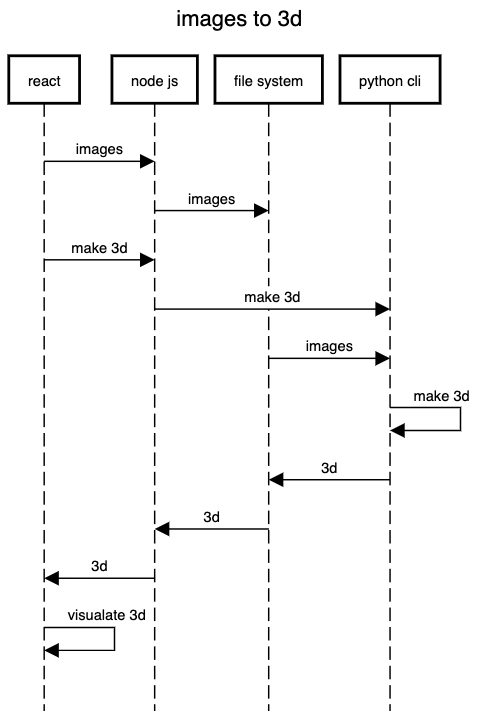
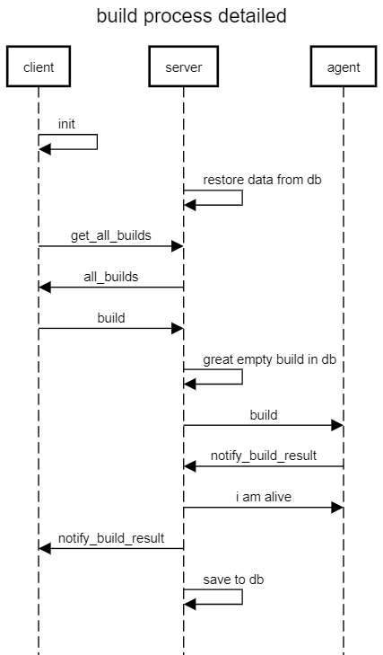

# shri-2019-hw__ci
Простая система continuous integration.

[ТЗ](docs/TASK.md)

## Запуск

## Production запуск

#### Запуск server

```npm
cd server &&
npm install &&
npm start
```

#### Запуск agent

```npm
cd agent &&
npm install &&
npm start
```

## Dev запуск

#### Запуск server back

```npm
cd server/back &&
npm install &&
npm run star
```

#### Запуск server front

```npm
cd server/front &&
yarn &&
yarn start
```

#### Запуск agent

```npm
cd agent &&
npm install &&
npm run start-dev
```

## Схемы работы приложения

### Общая схема сборки

```
title easy build process

client->server:build
server->agent:build
agent->server:notify_build_result
server->client:notify_build_result
```



### Подробная схема сборки

```
title build process detailed

client->client:init
server->server:restore data from db
client->server:get_all_builds
server->client:all_builds
client->server:build
server->server:great empty build in db
server->agent:build
agent->server:notify_build_result
server->agent:i am alive
server->client:notify_build_result
server->server:save to db
```




[service for UML visualization](https://sequencediagram.org/)